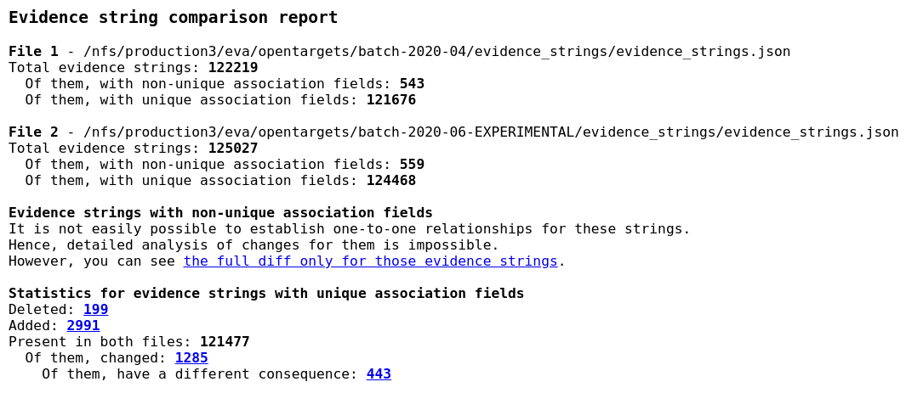
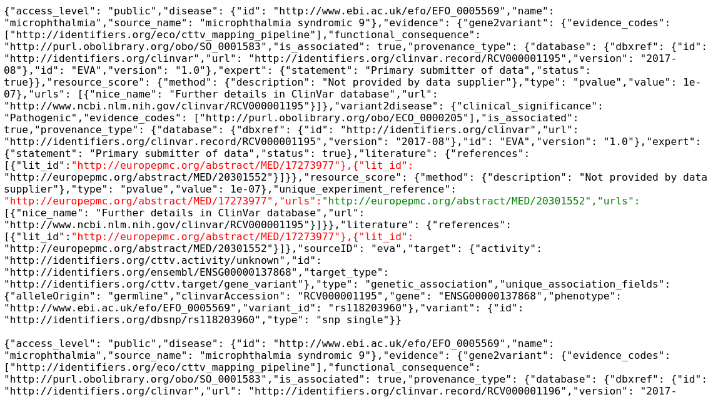
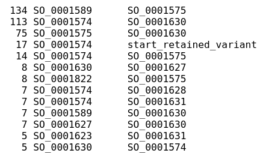

# Protocol for comparing evidence strings

## Overview
Comparing two sets of evidence strings can be a useful control measure for validating changes in source data and/or processing code to ensure there are no regressions, such as unexpected losses of a subset of the evidence strings. However, since the evidence strings are in JSON format, they require some preprocessing to run a meaningful diff. This protocol performs it and generates user-friendly output files and summary statistics.

The scripts for running this comparison are located in the [`compare-evidence-strings`](../compare-evidence-strings) subdirectory. The functionality supported by the current version of the protocol:

* Preprocess to make the diffs less noisy
  - Ensure stable sort order
  - Sort keys lexicographically in each evidence string
* Classify the evidence string into categories
  - Using the association fields (currently it's association fields specific to our data), it splits the evidence strings into non-unique (in at least one comparison set) and unique.
  - For unique evidence strings, a one-to-one mapping between old and new sets is established, and they are separated into "deleted", "common", and "new".
* Calculate some derivative statistics
  - Summary for counts in each category (non-unique, deleted, common, new)
  - Frequency of transitions for values of a certain field (currently it's only functional consequences) as a separate table
* Produce the diffs in easy-to-read format
  - Separated by category
  - Using the word diff mode, so that the changes inside an evidence string are highlighted
  - Presented in HTML format which is much easier to read than the console output

## Running the comparison
```bash
export INSTANCE_NAME=evidence-comparison
export INSTANCE_ZONE=europe-west1-d

# Create the instance and SSH.
gcloud compute instances create \
  ${INSTANCE_NAME} \
  --project=open-targets-eu-dev \
  --zone=${INSTANCE_ZONE} \
  --machine-type=e2-highmem-2 \
  --service-account=426265110888-compute@developer.gserviceaccount.com \
  --scopes=https://www.googleapis.com/auth/cloud-platform \
  --create-disk=auto-delete=yes,boot=yes,device-name=${INSTANCE_NAME},image=projects/ubuntu-os-cloud/global/images/ubuntu-2004-focal-v20210927,mode=rw,size=500,type=projects/open-targets-eu-dev/zones/europe-west1-d/diskTypes/pd-balanced
gcloud compute ssh --zone ${INSTANCE_ZONE} ${INSTANCE_NAME}
screen

# Set up the instance.
sudo apt update
sudo apt -y install aha jq python3-pip python3-venv
git clone https://github.com/opentargets/ot-release-metrics
cd ot-release-metrics
python3 -m venv env
source env/bin/activate
python3 -m pip install -r requirements.txt
cd compare-evidence-strings
```

Now, to compare two sets of evidence strings, download and uncompress them, then run:
```bash
bash compare.sh \
  old_evidence_strings.json \
  new_evidence_strings.json
```

Only uncompressed, plain JSON files are supported. The script will take a few minutes to run and will create a `comparison/` subdirectory in the current working directory. It will contain several intermediate files, and a single final file under the name of **`report.zip`**. (You can download an example of this final file [here](../compare-evidence-strings/report-example/report.zip).)

## Understanding the results
Copy the `report.zip` to your local machine, unzip, and open `report.html` in any web browser. It contains an index page outlining the major statistics of differences between the evidence strings:



### Association fields
First two sections describe statistics per input file. The evidence strings are divided into two groups: those where the association fields are unique (the majority), and those where they are not.

For the EVA/ClinVar use case, the association fields are:
1. ClinVar RCV record accession
1. Ontology term specifying which phenotype/trait is contained in the record
1. Allele origin (germline or somatic)
1. Variant ID (RS ID, if present, or the same RCV ID as in the first field)
1. Ensembl gene ID

### Diff for evidence strings with non-unique association fields
If a certain set of association fields occurs more than once for at least one of the input files, the evidence strings falls in the “non-unique” category. They cannot be easily paired between files 1 and 2, so for them only a bulk diff between the two files is produced, which is available through a diff link.

### Diffs and statistics for evidence strings with unique association fields
If a certain set of association fields occurs at most once per each of the files, its evidence strings will be in the “unique” category. For them, it is easy to pair old and new evidence strings together, and to carry out more detailed analysis.

Evidence strings which occur only in the first file are marked as “deleted”, and their list is available by clicking on the total number.

Similarly, evidence strings which occur only in the second file are marked as “added”, with the full list available over a link.

Evidence strings which are present in both files (judging by the association fields) are also counted and have two progressively more restrictive categories.

Evidence strings which have changed some of their fields (but not the association fields) between files 1 and 2 are part of the previous category. They are counted and the diff is available over a link, for example:



Evidence strings for which the **functional consequence** specifically has changed are part of the _previous_ category. By clicking on their total count, you will see the frequency of transitions between different functional consequence types (from file 1 to file 2) to see if there are any patterns:



## Future improvements

### Improve detection of identifying fields
Currently, the evidence strings are just being sorted and compared as strings. This can be improved by specifying or, even better, detecting the identifying fields (such as study ID etc.)

### Alternative library for rendering diffs
The [diff2html-cli](https://github.com/rtfpessoa/diff2html-cli) is a more advanced library which can be used to replace `aha` in the future.

### json-diff
There is a [json-diff](https://pypi.org/project/json-diff/) module which allows detailed comparison of JSON objects. If this protocol is going to be updated in the future, this module might be helpful. It provides structured overview of differences; however, it has a few limitations:
 * It can only compare individual evidence strings (so they must be sorted and matched beforehand)
 * When a field's value is updated, `json-diff` only reports the new value of the field, but not the old one, for example:
```json
{
    "_update": {
        "evidence": {
            "_update": {
                "gene2variant": {
                    "_update": {
                        "functional_consequence": "http://purl.obolibrary.org/obo/SO_0001575"
                    }
                }
            }
        }
    }
}
```

Here, the change was from SO_0001589 to SO_0001575, but only the second value is reported.
